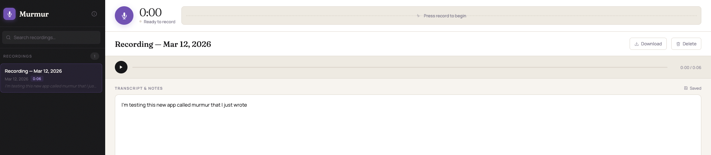
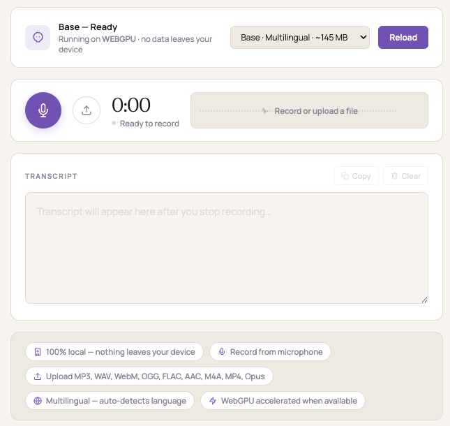

# Murmur

A minimal single-page app for voice recording and transcription. No server required — runs entirely in the browser.

**[Try it →](https://navinvarma.github.io/murmur)**

## Murmur AI — Local Transcription

Transcribe audio files entirely in your browser using OpenAI Whisper via WebGPU. No data leaves your device.

**[Try Murmur AI →](https://navinvarma.github.io/murmur/transcribe.html)**

- **Record** from your microphone or **upload** audio files
- **Supported formats:** MP3, WAV, WebM, OGG, FLAC, AAC, M4A, MP4, Opus
- **Multilingual** — auto-detects language
- **WebGPU accelerated** when available, falls back to WASM
- **Three model sizes:** Tiny (~40 MB), Base (~145 MB), Small (~244 MB)
- Models download once and are cached locally in your browser

## Usage

Open `index.html` in a modern browser (or visit the link above). Allow microphone access, record, and get a transcription.

For local AI transcription, open `transcribe.html` — load a Whisper model, then record or upload an audio file.

## License

Apache 2.0 — see [LICENSE](LICENSE).
